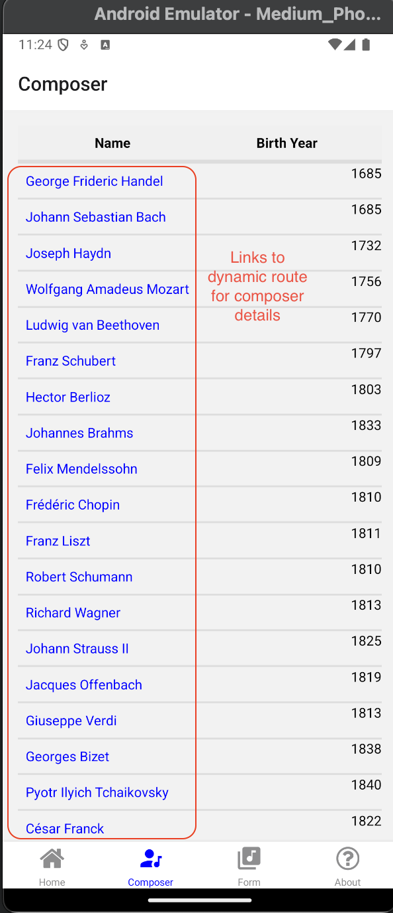
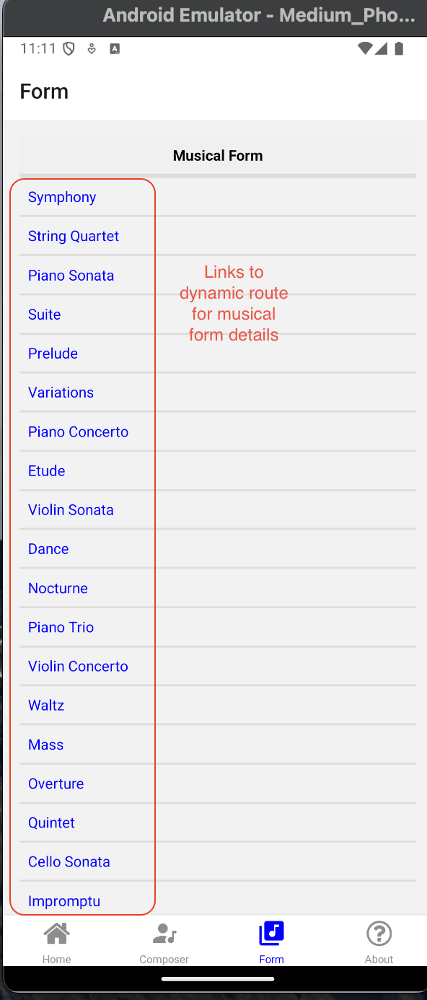

# Music Pearls Mobile 𝄡

## The mobile version of [musicpearls.org](https://www.musicpearls.org/) with React Native

### App Screens:

  <b>Home Screen with Tabs Navigator from Expo framework</b>
   
  

  <b>About page with disclaimers and documentation</b>
   
  

  <b>Composer choice page, a scrollable view with links to dynamic composer routes</b>
   
  

  <b>Just like composer choice, Form choice page with links to dynamic form routes</b>
   
  

  <b>Composer details page, a tab with dynamically generated title and scrollable view which renders OpusBox components with data from chosen composer</b>
   
  

  <b>Musical Form details page, also tab with dynamically generated title and scrollable view rendering OpusBox components with data from chosen musical form</b>
   
  

